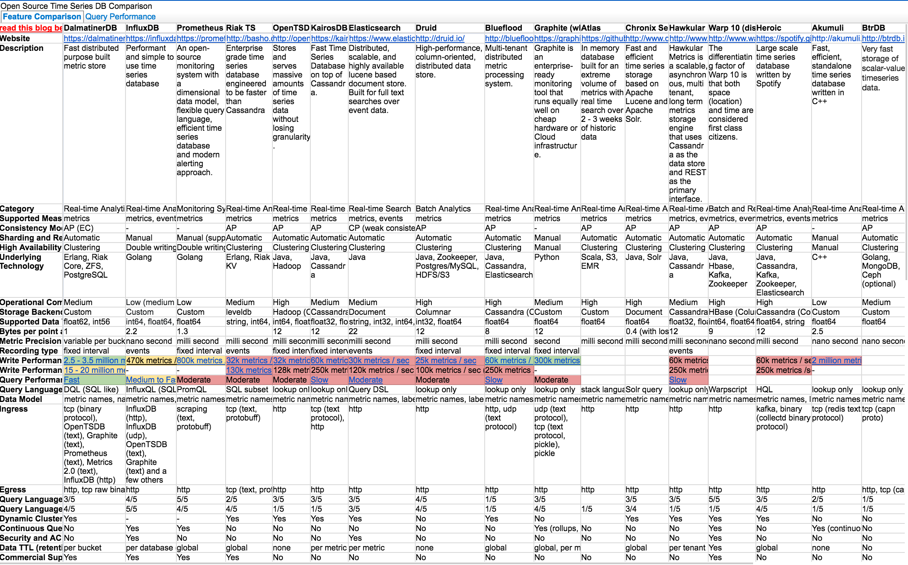
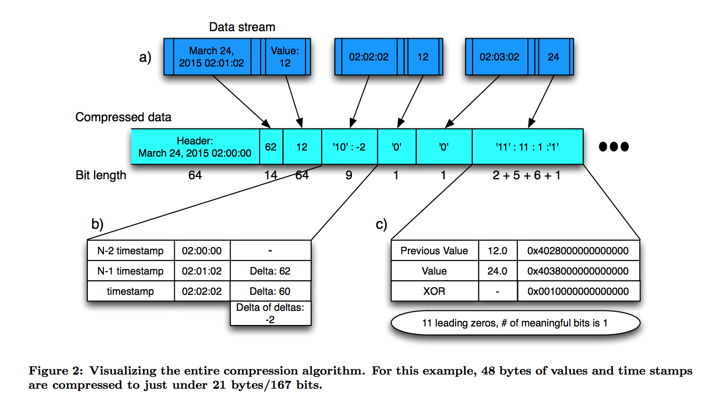
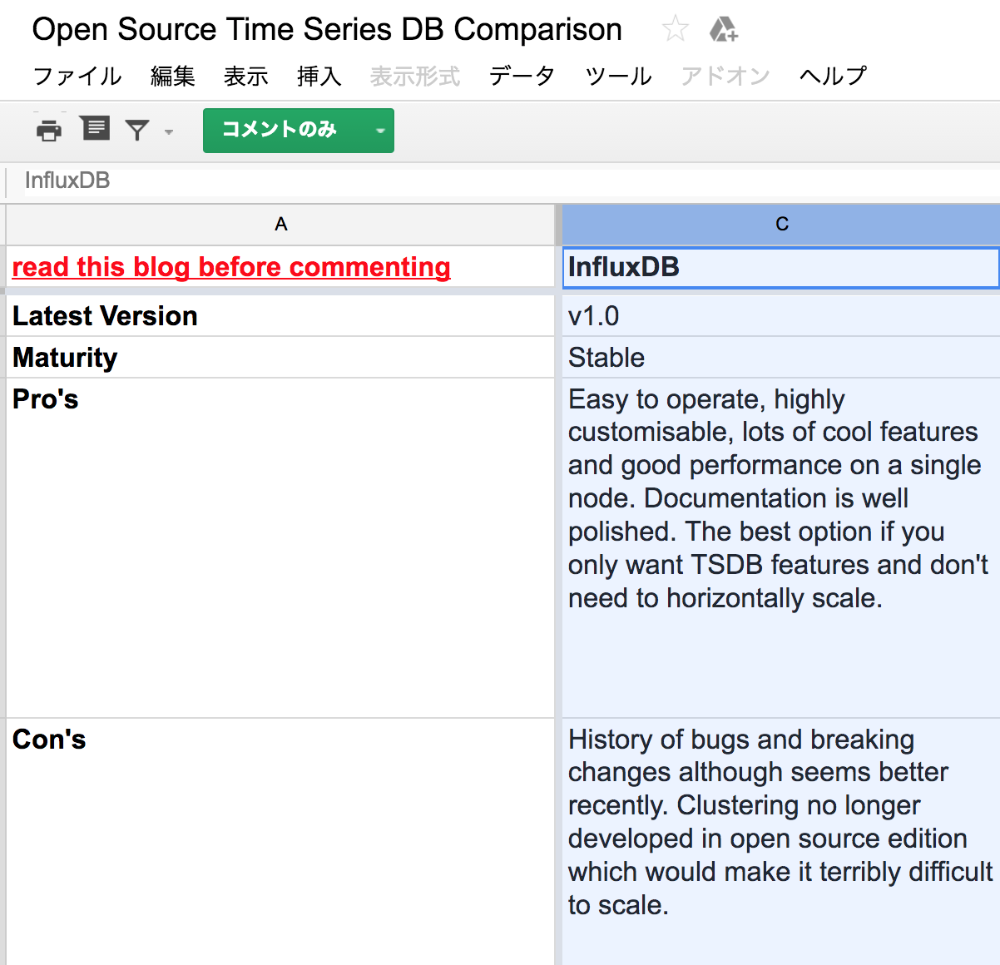
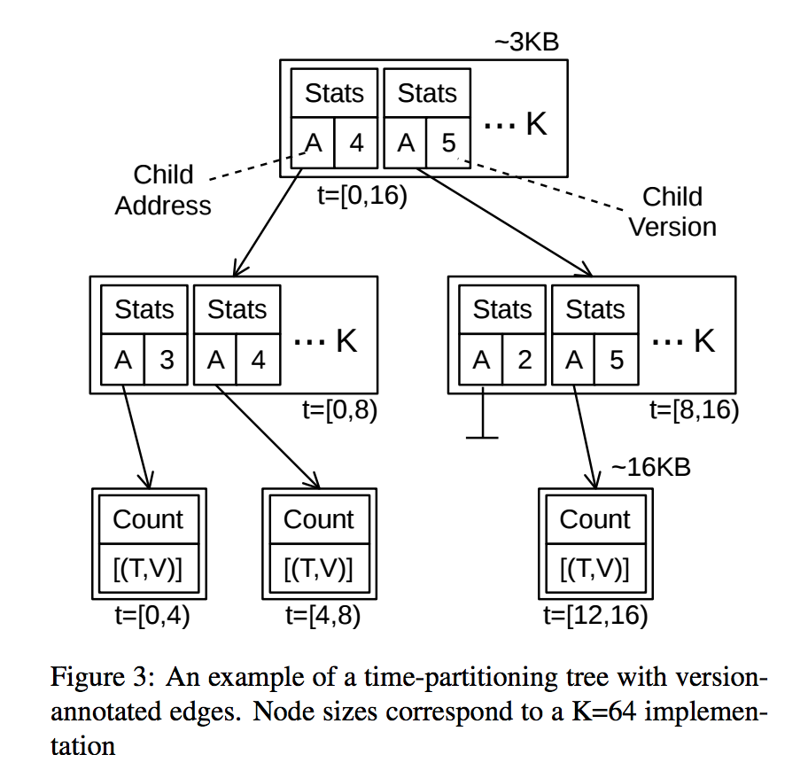
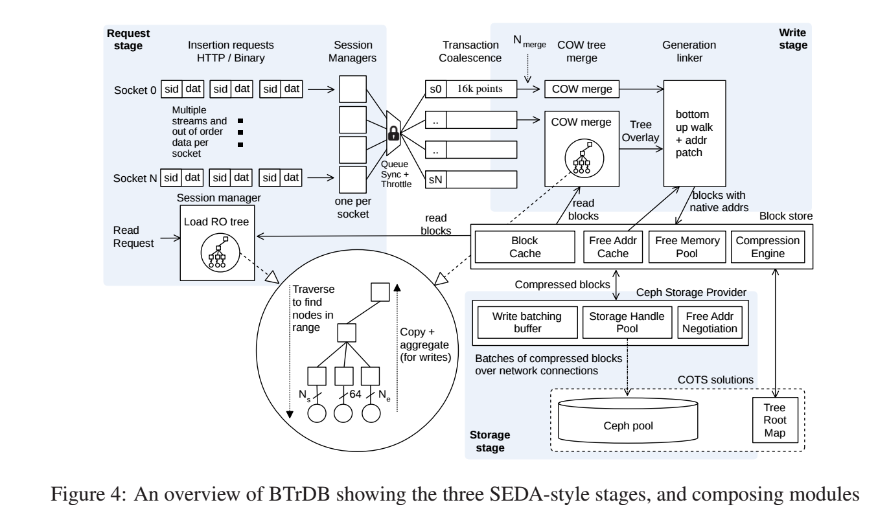

footer: hbstyle 2016/10/13 - Yoshikawa Ryota ( @rrreeeyyy )
slidenumbers: true
autoscale: true

# Time series database world

---

## Time series database (TSDB) とは

- 時系列データを格納する目的に特化したデータベース
    - 時系列データ: 時間で変化する連続的な値のこと
- IoT 機器が発展してきて流行ってる感がある
- 管理サーバ台数増加・メトリクスの高分解能化などで注目
    - インフラエンジニア的な観点です

---

## 時系列データベースの歴史

---

## Round Robin Database (RRD)

- 昔からあるシンプルな時系列データベース
- 時系列データベースを学ぶには丁度よい
    - シンプルなので分かりやすい
- データフォーマットがとてもシンプル
    - 古いデータの処理方法は丸め込みをする・上書きする
- `rrdtool` コマンドは人間には少し難しい気がする

---

## round robin database file format [^1]

```
  +-------------------------------+
  | RRD Header                    |
  |-------------------------------|
  | DS Header (one per DS)        |
  |-------------------------------|
  | RRA Header (one per RRA)      |
  |===============================| < 1 kByte (normally)
  | RRA Data Area (first RRA)     |
  ................................. The bulk of the space
  | RRA Data Area (last RRA)      | 
  +-------------------------------+ >
```

[^1]: http://oss.oetiker.ch/rrdtool-trac/wiki/TuningRRD

---

## rrdtool graph command example [^2]

```
$ rrdtool graph ./graph.png \
    --start="1360892438-1w" \
    --end="1360892438+1w" \
    --imgformat=PNG \
    --title="Load Average (1min)" \
    --height=200 \
    --width=500 \
    --lower-limit=0 \
    DEF:load=test.rrd:load_1min:MAX \
    VDEF:a=load,LSLSLOPE \
    VDEF:b=load,100,PERCENTNAN \
    CDEF:predict=load,POP,a,COUNT,*,b,+ \
    SHIFT:predict:604800 \
    AREA:load#CC0000:"Load Average (1min)" \
    LINE1:predict#00CC00:"Predict" \
    LINE2:2#CCCCCC:"Limit" \
```

[^2]: https://heartbeats.jp/hbblog/2013/02/predict-rrdtool.html

---

## Graphite(whisper)

- RRD の課題を解決するために書かれた [^3]
    - データ構造などは RRD に割と似ている
- carbon や graphite-web などのデーモンと協調して動く
    - ネットワーク経由でのデータ書き込み・読み出しが出来る
- 2016 年現在で主流に近いであろう TSDB
    - Grafana 等の可視化ツールも充実している

[^3]: http://graphite.wikidot.com/whisper

---

## Whisper file format [^4]


[^4]: http://www.aosabook.org/en/graphite.html

---

## TSDB に必要になってきたこと

- 書き込み要求を高速に捌けること
    - 書き込み自体が高速である必要はあまりない
- 高いデータ圧縮率
    - データ量が RDBMS 等に比べて大量になるので圧縮が必要
    - 特定の世代別にパージなども行う必要がある
- 時系列データを(高速に)統計処理出来ること
    - 統計処理を行う言語は分かりやすいとなお良い
- 時系列データベース自体の冗長性の確保

---

## 近代の時系列データベースたち [^5]



[^5]: https://docs.google.com/spreadsheets/d/1sMQe9oOKhMhIVw9WmuCEWdPtAoccJ4a-IuZv4fXDHxM

---

## とにかくたくさんある

---

## どうやって選ぶか

- 当然自分の用途に応じて選ぶ
    - 書き込み速度？
    - 読み込み速度？
    - データ圧縮率？
    - 統計クエリの書きやすさ？
    - 運用しやすさ？
- 全部欲しいのは分かるが必要に応じて取捨選択する

---

## 近代の時系列データベースたち

- ソフトウェア工学的な知見から設計し直している事が多い
    - データ圧縮にちゃんと差分符号化を使うとか 
        - タイムスタンプのΔ が同じになりやすいことに着目
        - メトリクスは似たような値を推移しやすいことに着目
    - 書き込み要求を高速に処理するために SEDA を採用するとか
    - 冗長化機構に Paxos, Raft を使うとか
    - データ構造に独自の Memory Map や LSM-based な構造や CoW tree を使うとか
- 内部構造を正しく知っておくことでどういう特性があるか分かる

---

## Time series databases

- 最近論文とかドキュメントを読んだ 3 つの TSDB を紹介
    - Gorilla
        - http://www.vldb.org/pvldb/vol8/p1816-teller.pdf
    - InfluxDB
        - https://www.influxdata.com/
    - BtrDB
        - http://btrdb.io/

---

## Gorilla [^6]

- Facebook の開発している TSDB
    - インフラのメトリクス取得のために使っているらしい
    - 2013 年に HBase-based な TSDB を置き換えるために作られた
- Timestamp, Value(float) それぞれに圧縮アルゴリズムを持っている
- メモリ上のデータ構造(TSmap) も独自に持っている
- 冗長化機構(Paxos ベースのもの等) が備わっている
- Correlation(PPMCC)/Charting/Aggregations の機能もあるっぽい

[^6]: http://www.vldb.org/pvldb/vol8/p1816-teller.pdf

---

## Gorilla requiremets

- 設計時の要求仕様 (refs: 2.2 Gorilla requirements)
    - キーの数は 20 億
    - 毎分 7 億のデータポイント(= timestamp,value) が追加される
    - データは 26 時間保持
    - ピーク時に 40000/sec クエリ
    - 時系列データの粒度は 15 秒までサポート
    - :

---



---

## InfluxDB

- InfluxData 社が作っている Golang 製の TSDB
- 0.9.5 から独自のストレージエンジンを開発している [^7]
    - Time Structured Merge Tree
    - LSM-tree ベースだが時系列データ用にカスタマイズ [^8]
- データ型は自由で Bool, Integer, String 等データ型ごとに圧縮アルゴリズムがある
    - Float, Integer 等の圧縮手法は Gorilla と同じ
    - String には Snappy 圧縮を使用している
- Query language は SQL-like な InfluxQL。それなりに早いし扱いやすい。

[^7]: https://docs.influxdata.com/influxdb/v1.0/concepts/storage_engine

[^8]: https://speakerdeck.com/pauldix/influxdbs-new-storage-engine-the-time-structured-merge-tree

---

 

^ [^5]

---

## BtrDB [^9]

-  Berkeley Tree DataBase (FAST '16 で発表されていた [^10])
    - Golang で書かれている
- データ構造は CoW tree を使っている
    - Max/Min/Avg を保持したり世代を保持したりしている
- SEDA architecture を採用している模様
    - Request stage と Read/Write stage がある
- Block storage に Ceph サポートがある

[^9]: http://btrdb.io/

[^10]: https://www.usenix.org/system/files/conference/fast16/fast16-papers-andersen.pdf

---



^ [^10]

---



^ [^10]

---

## まとめと感想

- 昔からある TSDB 〜 最近の TSDB を簡単に紹介
- TSDB に求められている事と最近の TSDB がどう対応しているか紹介
- 内部構造のドキュメント・論文を読むと挙動が推察できて面白い
    - 例えば BtrDB は統計処理速度が結構早そう、など
        - 逆にデータ圧縮率はそんなに求めて無さそう
- 内部構造が分かると求めるものに応じて良い TSDB を選べるようになりそう
    - 読んでて勉強になるし面白いのでみんな読みましょう

---

## 参考文献

- http://oss.oetiker.ch/rrdtool-trac/wiki/TuningRRD
- https://heartbeats.jp/hbblog/2013/02/predict-rrdtool.html
- http://graphite.wikidot.com/whisper
- http://blog.yuuk.io/entry/high-performance-graphite
- http://www.aosabook.org/en/graphite.html
- https://docs.google.com/spreadsheets/d/1sMQe9oOKhMhIVw9WmuCEWdPtAoccJ4a-IuZv4fXDHxM
- http://www.vldb.org/pvldb/vol8/p1816-teller.pdf
- https://docs.influxdata.com/influxdb/v1.0/concepts/storage_engine
- https://speakerdeck.com/pauldix/influxdbs-new-storage-engine-the-time-structured-merge-tree
- http://btrdb.io/
- https://www.usenix.org/system/files/conference/fast16/fast16-papers-andersen.pdf
